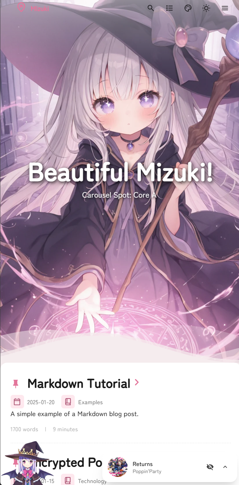

# 🌸 Halei0v0's Mizuki  Blog
 
 

<table>
  <tr>
    <td></td>
    <td></td>
    <td></td>
  <tr>
  <tr>
    <td></td>
    <td></td>
    <td></td>
  <tr>
</table>
---

⭐ If you find this project helpful, please consider giving it a star!