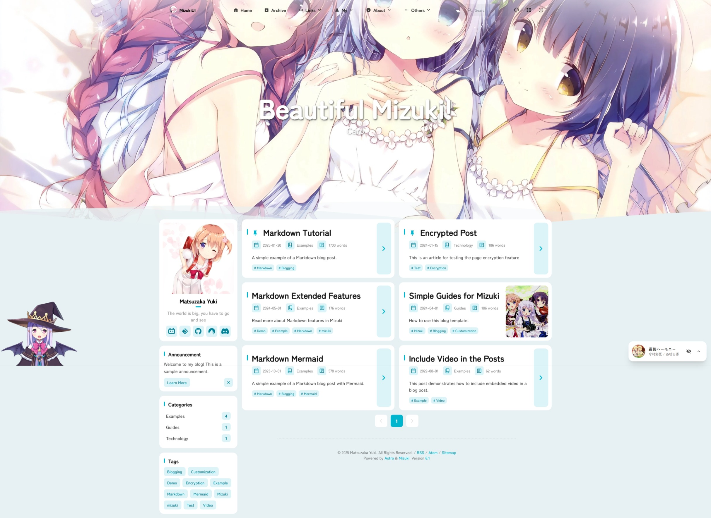

# 前言

> 最近修改博客多多少少遇到一些问题但总体上无大碍
>
> 但是为什么Mizuki作者要在我好不容易从5.1更新到5.3的情况下推出6.1pro？？
>
> 很无语好吗啊喂(#`O′)！！

# Mizuki博客6.1pro

* **页面重构**：完全重构动漫、时间线、项目、技能、相册、朋友、日记和关于页面，以获得更好的性能和用户体验。
* **页面切换功能**：添加了带有 SEO 优化模块的页面切换功能，允许控制功能页面可见性。
* **新的网格布局**：引入了新的网格文章列表布局，以改进内容呈现。
* **涟漪管理**：添加了涟漪效应管理模块以增强视觉交互。
* **简单图标支持**：添加了对简单图标的支持，可以访问更丰富的图标库以进行界面自定义。
* **移动文章列表布局**：推出专为移动设备优化的全新文章列表布局，提高了小屏幕上的可读性和作便利性。
* **RSS 和 ATOM**：优化 RSS 和 ATOM 的移动布局。

> 不过我觉得重构以后的文章列表好像不怎么好看，要更新有空再折腾吧，最近有点累了😔，大家有时间可以去试试~

# Mizuki模板下载地址

::github{repo="matsuzaka-yuki/Mizuki"}

V 6.1:[Release Mizuki v6.1 Pro ](https://github.com/matsuzaka-yuki/Mizuki/releases/tag/6.0)

:::note

觉得6.1不好看的可以和我一起用5.3，其他版本多少问题都有点大，(●ˇ∀ˇ●)——踩过坑的我┭┮﹏┭┮

:::